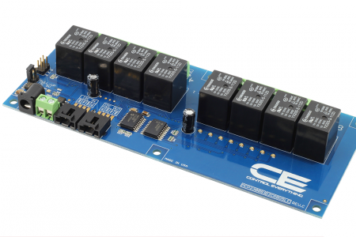

# MCP23008

The MCP23008 is a Integrated port expander that controls eight I/O channels through the I2C bus.

NCD.io provides several board that utilize this chip, most of our [I2C and IoT Relay Boards](https://store.ncd.io/?fwp_main_facet=iot-devices&fwp_product_type=relay-controllers) that are 8 channels and less use the MCP23008. Our larger boards, 16 channels and up, use the MCP23017

The 8-channel I2C relay controller pictured above can be found [here](https://store.ncd.io/product/8-channel-general-purpose-spdt-relay-controller-with-i2c-interface/)

You can find additional information about this repository in the programming language folders.
